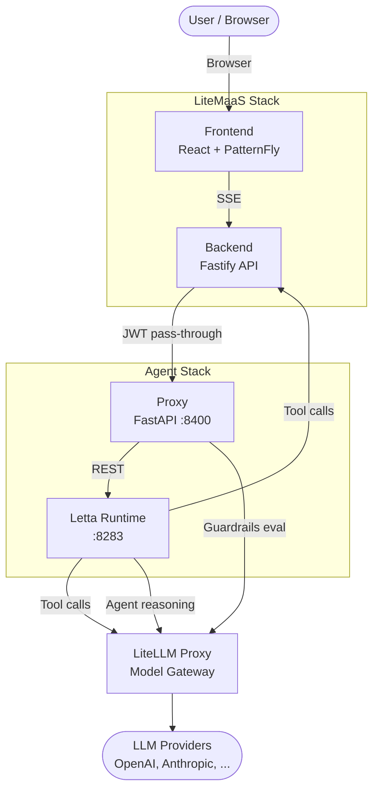
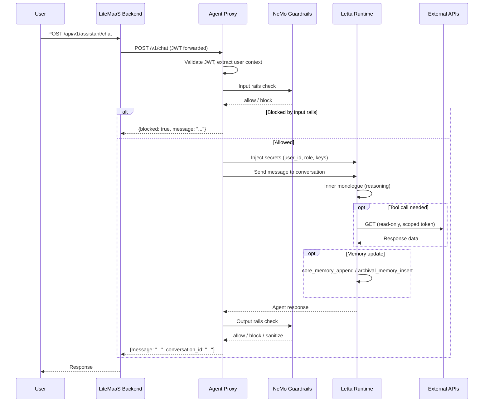
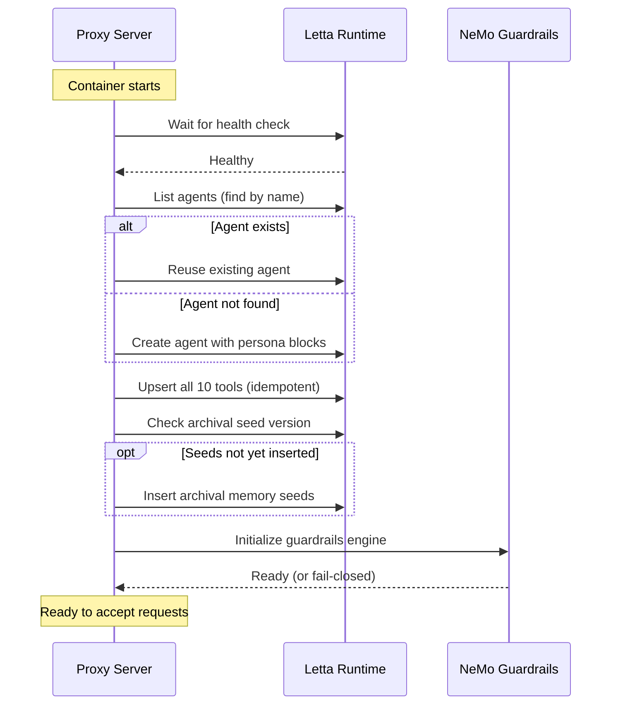
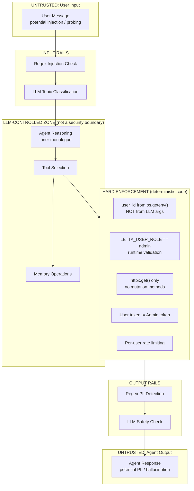
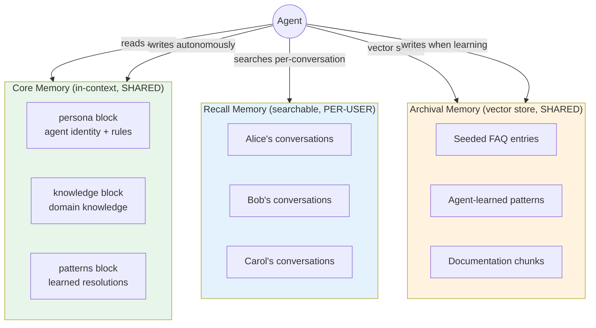
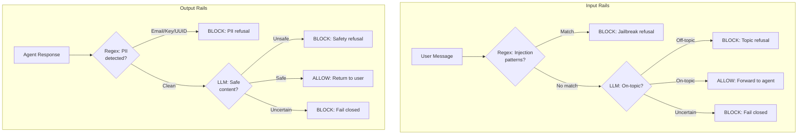
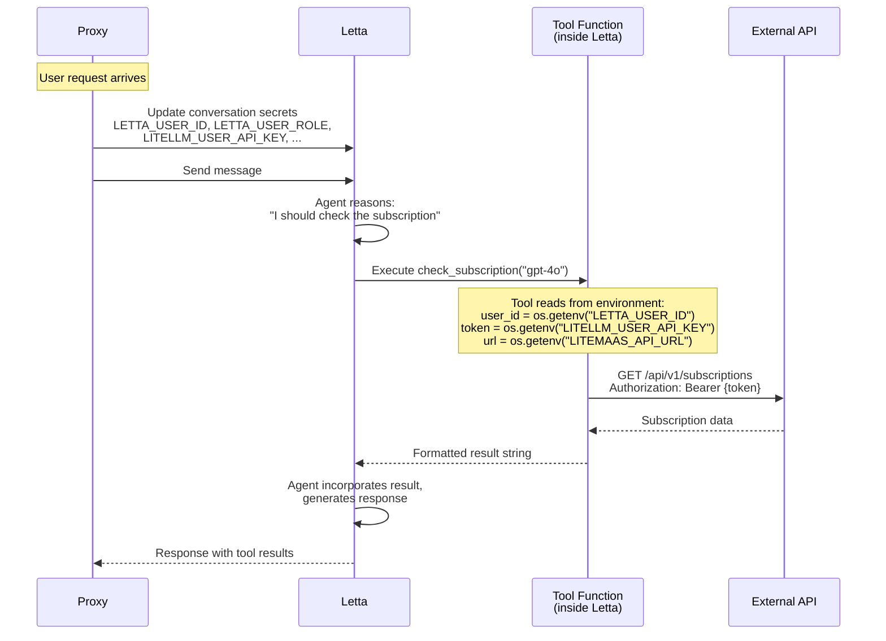

# Architecture Diagrams

Visual representations of the system architecture. All diagrams use Mermaid format for easy maintenance and render natively on GitHub.

## 1. System Context

How the agent fits into the LiteMaaS ecosystem. The agent stack is a standalone deployment that connects to existing LiteMaaS services.



## 2. Container Diagram

The two containers, their responsibilities, ports, and communication.

```mermaid
graph LR
    subgraph Proxy["Container 1: Proxy (port 8400)"]
        FastAPI[FastAPI Server]
        Auth[JWT Auth]
        GuardrailsEngine[NeMo Guardrails<br/>embedded library]
        Routes[/v1/chat<br/>/v1/health]
    end

    subgraph LettaContainer["Container 2: Letta (port 8283)"]
        AgentLoop[Agent Loop<br/>inner monologue]
        Memory[Memory<br/>Core + Recall + Archival]
        Tools[Registered Tools<br/>10 read-only functions]
        PG[(PostgreSQL<br/>+ pgvector)]
    end

    Volume[(letta-data<br/>volume)]

    FastAPI --> Auth
    FastAPI --> GuardrailsEngine
    FastAPI --> Routes
    Routes -->|REST API| AgentLoop
    AgentLoop --> Memory
    AgentLoop --> Tools
    Memory --> PG
    PG --> Volume
```

## 3. Request Flow

The full lifecycle of a chat message, from user to response.



## 4. Agent Bootstrap Sequence

What happens when the proxy container starts up.



## 5. Security Trust Boundaries

How security invariants are enforced across system zones.



## 6. Memory Architecture

Three-tier memory with scope and access patterns.



> **Isolation**: Core and Archival memory are shared — they must never contain user-identifying information. Recall memory is strictly per-conversation (per-user).

## 7. Guardrails Pipeline

Input and output rail evaluation flows.



## 8. Tool Execution Model

How tool secrets are injected and tools execute inside Letta.


