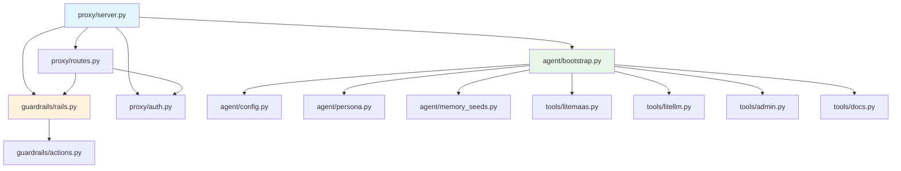

# Module Reference

How the code is organized. Read this to understand the codebase without opening source files.

**Total**: ~1,400 lines of production code across 5 packages. All source lives in `src/` with `PYTHONPATH` set to `src/`.

## Module Dependency Graph

> **Key constraint**: Tools (`src/tools/*`) are plain functions registered with Letta via `client.tools.upsert_from_function()` at bootstrap. They execute **inside Letta's process** at runtime. They cannot import from other `src/` modules. All imports must be inline within the function body.

---

## `src/proxy/` — FastAPI Proxy Server

The entry point for all requests. Handles auth, guardrails, and routing to Letta.

### `server.py` (183 lines)

Application factory with lifespan management.

- **`AgentState`** dataclass — holds the bootstrapped Letta client, agent reference, and conversation cache (keyed by `user_id`)
- **Lifespan hooks** — on startup: wait for Letta health, bootstrap agent, initialize guardrails. On shutdown: cleanup
- **`_agent_state`** / **`_guardrails`** — module-level singletons set during lifespan
- **`GET /v1/health`** — health endpoint returning agent connection status, guardrails status, and `agent_id`
- **Conversation management** — `get_or_create_conversation()` finds existing conversations by user ID via summary-based lookup, or creates new ones

### `routes.py` (153 lines)

The main chat endpoint.

- **`POST /v1/chat`** — six-step flow:
  1. Run input guardrails
  2. Inject user context into Letta conversation secrets (asyncio lock serializes updates)
  3. Get or create conversation for this user
  4. Send message to Letta
  5. Extract assistant message from Letta response
  6. Run output guardrails
- **`ChatRequest`** / **`ChatResponse`** — Pydantic models with field validation
- **`_secrets_lock`** — `asyncio.Lock` serializing agent secret updates (prevents race conditions)
- **`_extract_assistant_message()`** — handles Letta's response format

### `auth.py` (85 lines)

JWT validation.

- **`AuthenticatedUser`** — frozen dataclass with `user_id`, `username`, `email`, `roles`, `is_admin`, `iat`, `exp`
- **`validate_jwt()`** — FastAPI dependency. Extracts Bearer token, decodes HS256, validates required claims
- Strict validation: all claims (`userId`, `username`, `email`, `roles`) must be present

---

## `src/agent/` — Agent Configuration and Bootstrap

### `bootstrap.py` (141 lines)

Idempotent agent creation and initialization.

- **`bootstrap_agent()`** — creates or reconnects to a Letta agent by name. If agent exists, reuses it. Registers all tools and seeds archival memory
- **`_register_tools()`** — upserts all 10 tools via Letta SDK (idempotent — safe to call on every startup)
- **`_seed_archival_memory()`** — version-tracked insertion. Uses `SEED_VERSION_MARKER` to detect if seeds have already been inserted (avoids duplicates)
- **`AGENT_NAME`** constant — the agent identifier in Letta

### `config.py` (40 lines)

Pydantic-settings `Settings` class.

- Reads all values from environment variables (no `.env` file parsing in code)
- Groups: core (Letta URL, LiteMaaS URL, JWT), LLM providers (agent model, guardrails model), monitored platform (LiteLLM URLs, keys), optional (rate limits, guardrails mode)
- **`guardrails_required`** flag — if `True` (default), proxy refuses to start if guardrails initialization fails

### `persona.py` (38 lines)

Three core memory blocks as string constants:

- **`PERSONA_BLOCK`** — agent identity, capabilities, PII prohibition rules
- **`KNOWLEDGE_BLOCK`** — platform-specific domain knowledge (model types, subscription states, common patterns)
- **`PATTERNS_BLOCK`** — initially empty, updated by the agent as it learns resolution patterns

### `memory_seeds.py` (43 lines)

- **`ARCHIVAL_SEEDS`** — list of FAQ entries for vector store seeding
- 4 initial seeds: model access troubleshooting, API key issues, subscription management, platform overview

> **Note**: `SEED_VERSION_MARKER` is defined in `bootstrap.py` (not here), since it's part of the seeding logic.

---

## `src/tools/` — Platform Tools

### Self-Containment Constraint

Tools run inside Letta's process, not the proxy. Letta extracts function source code at registration time. This means:

- **No imports from other `src/` modules** — each tool function must be fully self-contained
- **All imports inline** — `import os`, `import httpx` inside the function body
- **Configuration via `os.getenv()`** — API URLs, keys, user identity all come from environment variables
- **Dependencies must be in Letta's image** — `httpx` is available in the stock `letta/letta` image

### `litemaas.py` (214 lines)

4 tools calling the LiteMaaS backend API:

| Tool | API Called | Purpose |
|---|---|---|
| `list_models(search)` | `GET /api/v1/models` | List available models with provider/status |
| `check_subscription(model_name)` | `GET /api/v1/subscriptions` | Check user's subscription and quota for a model |
| `get_user_api_keys()` | `GET /api/v1/api-keys` | List key names, prefixes, status, budget (never full keys) |
| `get_usage_stats()` | `GET /usage/budget` + `/usage/summary` | Budget, spend, 30-day usage, per-model breakdown |

`list_models` is a public endpoint (no auth). The other three use `Bearer LITELLM_USER_API_KEY` for auth and read `LETTA_USER_ID` from env.

### `litellm.py` (159 lines)

3 tools calling the monitored LiteLLM proxy:

| Tool | API Called | Purpose |
|---|---|---|
| `check_model_health()` | `GET /health/liveness` | LiteLLM status and version |
| `get_model_info(model_name)` | `GET /model/info` | Provider, backend model, limits, capabilities |
| `check_rate_limits()` | `GET /key/info` | TPM/RPM limits, budget, per-model spend |

Uses `x-litellm-api-key` header. Handles the `2147483647` unlimited sentinel and both JSON/plain text health responses.

### `admin.py` (116 lines)

2 admin-only tools with runtime role validation:

| Tool | API Called | Purpose |
|---|---|---|
| `get_global_usage_stats()` | `POST /api/v1/admin/usage/analytics` | Global request count, tokens, cost, top models |
| `lookup_user_subscriptions(target_user_id)` | `GET /api/v1/admin/users/{id}/subscriptions` | All subscriptions for a target user |

Both validate `os.getenv("LETTA_USER_ROLE") == "admin"` inline before executing. Uses `LITELLM_API_KEY` (master key). `target_user_id` is validated with UUID regex.

### `docs.py` (30 lines)

1 placeholder tool:

| Tool | Purpose |
|---|---|
| `search_docs(query)` | Returns suggestion to use `archival_memory_search`. Will be enhanced in Phase 4. |

---

## `src/guardrails/` — NeMo Guardrails Integration

### `rails.py` (131 lines)

The guardrails engine wrapper.

- **`GuardrailsEngine`** class — wraps NeMo's `LLMRails`
- **`RailResult`** dataclass — `blocked: bool`, `response: str`
- **`check_input()`** / **`check_output()`** — async methods returning `RailResult`
- **Config loading** — reads from `config/`, substitutes env vars (`GUARDRAILS_MODEL`, `GUARDRAILS_LLM_API_BASE`, `GUARDRAILS_LLM_API_KEY`) into the NeMo model config
- **Fail-closed** — any exception during evaluation results in `blocked=True`
- **`_is_blocked()`** — refusal phrase heuristic (checks for "I'm sorry", "I cannot", "I can't" prefixes). Known limitation: may have false positives. Improvement planned for Phase 2E (carryover items — see [Project Plan](../development/PROJECT_PLAN.md))

### `actions.py` (80 lines)

3 custom Colang actions:

| Action | Purpose |
|---|---|
| `check_user_context()` | Validates `user_id` exists in NeMo context |
| `regex_check_output_pii()` | Detects emails, full API keys, UUIDs in output |
| `regex_check_input_injection()` | Detects jailbreak patterns: "ignore instructions", "pretend", "system prompt", "DAN mode", etc. |

### `config/` — Colang Rules and NeMo Configuration

| File | Purpose |
|---|---|
| `config.yml` | Model config (OpenAI-compatible), input/output rail flow definitions, system instructions |
| `topics.co` | On-topic intent (15 example utterances) and off-topic intent (6 examples) with refusal response |
| `privacy.co` | Placeholder for cross-user data isolation (Phase 3A) |
| `safety.co` | Refusal response definitions for unsafe output and jailbreak attempts |
| `prompts.yml` | Prompt templates for `self_check_input` and `self_check_output` evaluation |

---

## `src/adapters/` — Platform Adapters (Placeholder)

- **`base.py`** — empty (future: abstract adapter interface)
- **`litemaas.py`** — empty (future: LiteMaaS-specific adapter implementation)

The adapter layer is designed for reusability — adapting the agent to another platform. See [Adapting to Another Platform](../guides/adapting-to-another-platform.md).
